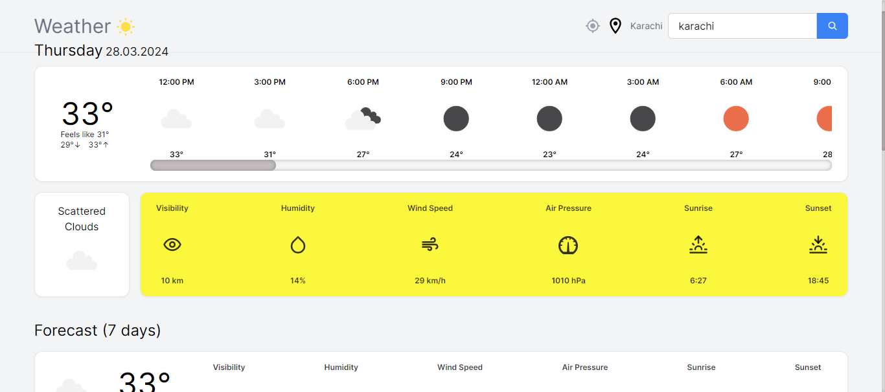

# Weather App in Next JS
I have build a fully functional weather app in Next JS using an <a href="https://openweathermap.org/">OpenWeather Api</a>

You can visit weather app by clicking <a href="https://weatherapp04.vercel.app/">https://weatherapp04.vercel.app/</a>

## Project Overview
1) In this weather aap, I have used <a href="https://openweathermap.org/">Open Weather free api</a> for realtime weather data.
2) I have used <a href="https://tanstack.com/query/v3/">React Query (Tanstack Query)</a> and a popular <a href="https://www.npmjs.com/">npm</a> package <a href="https://www.npmjs.com/package/axios">axios</a> for fetching weather data from OpenWeather server.
3) I have used <a href="https://tailwindcss.com/">Tailwind CSS</a> for providing styles to the components.
4) I also used <a href="https://react-icons.github.io/react-icons/">React Icons</a> for fullfill the requirement of icons in this app.

## Key features
1) In this app you can search weather details by searching city name.
2)  You can find your current location weather details by clicking on location button on the top right of the navbar.

## Project Image
